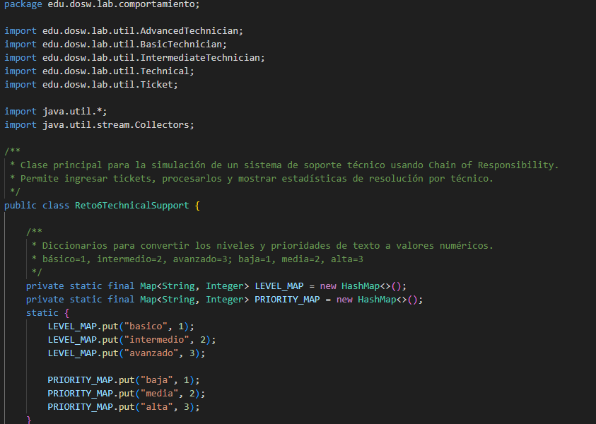
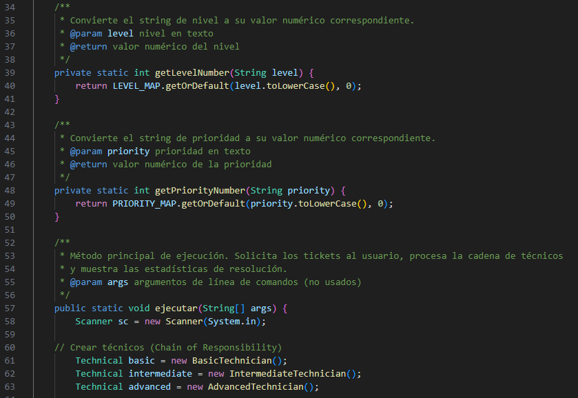
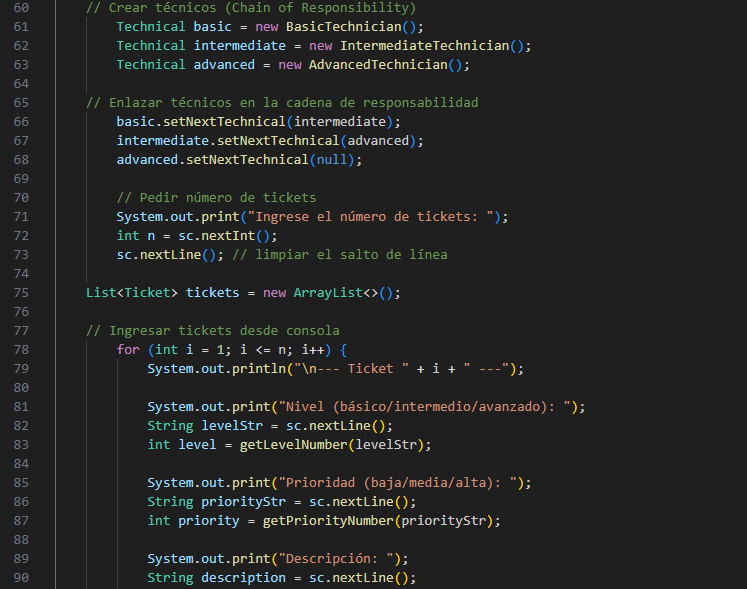
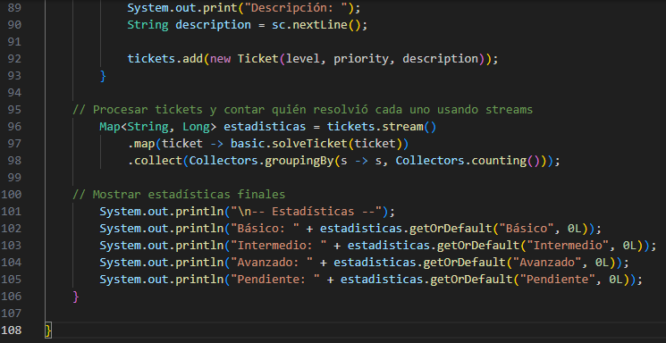

# 🧪Laboratorio 02 - SOLID, Patrones de Diseño y UML

**Integrantes**
 - Juan Diego Rodriguez Velasquez
 - Ignacio Andres Castillo Rendon
 - Anderson Fabian Garcia Nieto

**Nombre de la rama**
`feature/CastilloIgnacio_GarciaAnderson_RodriguezDiego_2025-2`

---

## ✔ Retos Completados

## Reto 6: Soporte Tecnico

**Evidencia Codigo Implementado**

	
	
	
	

**Evidencia Solución**

	
	

**Explicación Codigo (Diseño e implementación)**