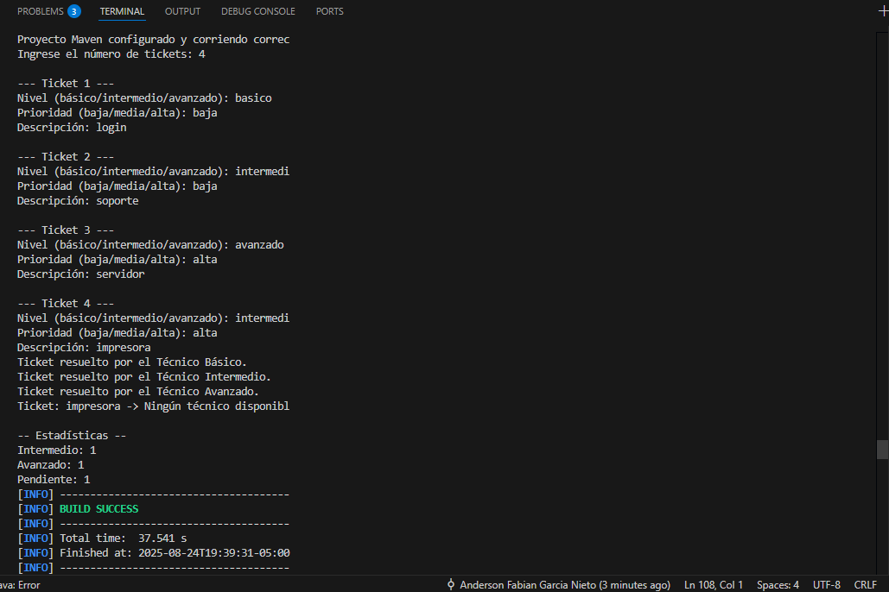
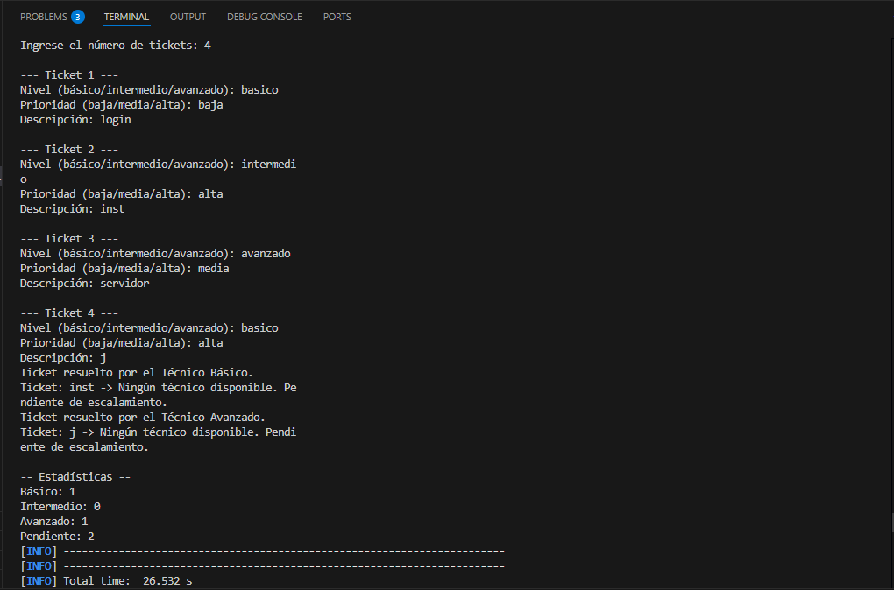
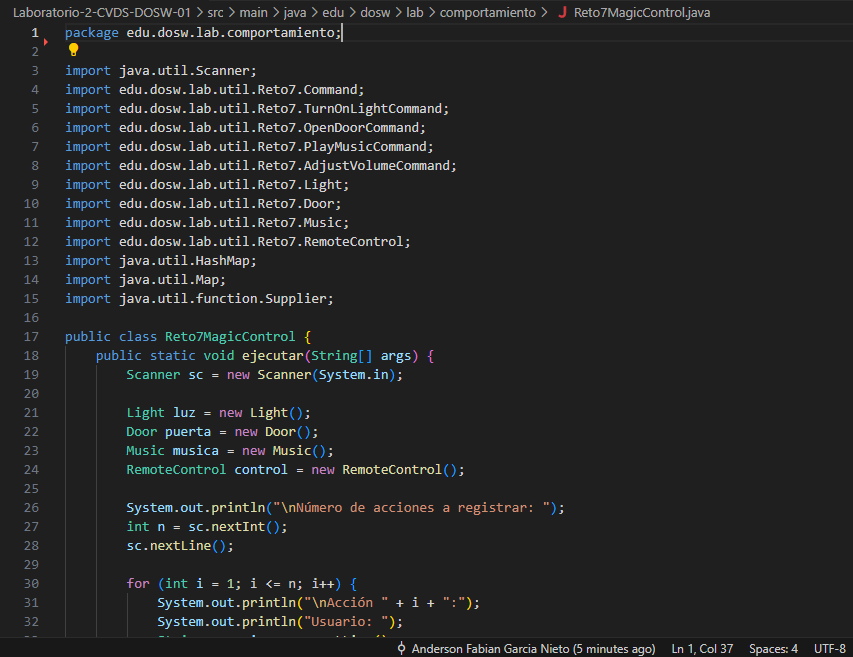
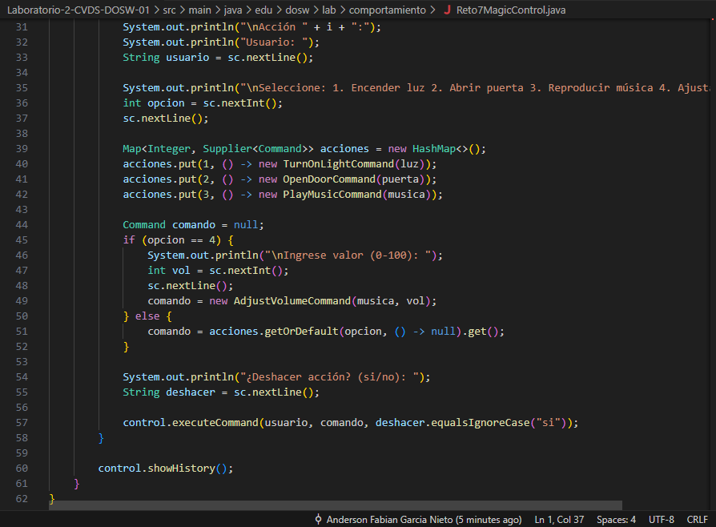
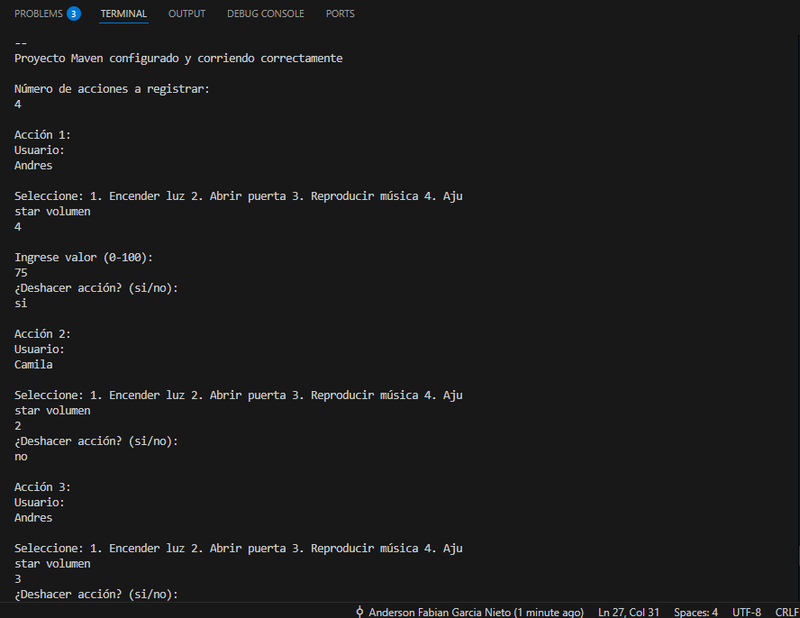
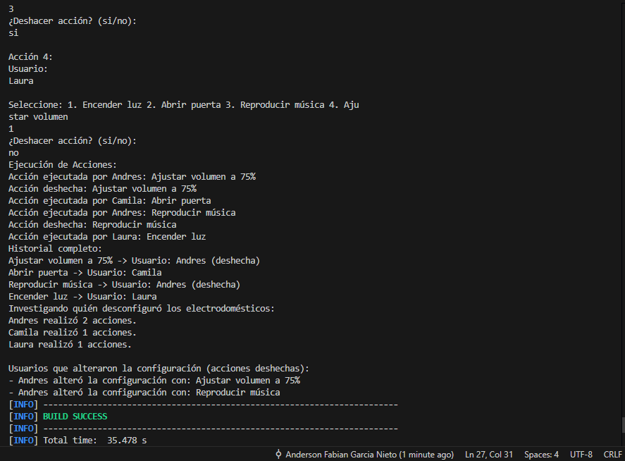

# 🧪Laboratorio 02 - SOLID, Patrones de Diseño y UML

**Integrantes**
 - Juan Diego Rodriguez Velasquez
 - Ignacio Andres Castillo Rendon
 - Anderson Fabian Garcia Nieto

**Nombre de la rama**
`feature/CastilloIgnacio_GarciaAnderson_RodriguezDiego_2025-2`

---

## ✔ Retos Completados

## Reto 6: Soporte Tecnico

**Evidencia Codigo Implementado**
-Solo se agregó el codigo del Main del reto, para no congestionar de imagenes el README.

	
	
	
	

**Evidencia Solución**

	
	

**Explicación Codigo (Diseño e implementación)**
---
El patron de diseño utilizado fué el de **Cadena de Responsabilidad**, este patron de diseño pertenece al grupo de patrones comportamentales.
Se destaca por que permite que múltiples objetos tengan la oportunidad de procesar una solicitud, pasándola a lo largo de una cadena hasta que alguien la maneje.

**Justificación**
---
Se escogió este patron de diseño, ya que calzaba perfectamente con el desarrollo del problema, donde los tickets empezaban desde el tecnico basico, siendo que si este podia resolver el ticket ahi acababa este, pero en el caso que no el ticket pasaba al siguiente nivel jerarquico(Con mas funcionalidades que el tecnico anterior) y se repetia esto mismo, si el nuevo tecnico no podia resolver el problema, entonces se lo delegaba al tecnico que se especializa un poco mas. A menos que ningun tecnico lo pueda desarrollar por diversos motivos, el ticket cambia de estado.

**Aplicación**
---
Se creó una clase abstracta tecnico, donde cada uno sabia quien era el siguiente, como era una clase abstracta, se crearon sus clases hijas siendo cada tecnico expecificamente con sus metodos sobreescritos, permitiendo que cada uno pudiera tener su logica propia para resolver un ticket o no.

## Reto 7: Control Magico
**Evidencia Codigo Implementado**
-Solo se agregó el codigo del Main del reto, para no congestionar de imagenes el README.

	
	

**Evidencia Solución**

	
	

**Explicación Codigo (Diseño e implementación)**
---

En el Reto 7 se implementó el patrón de diseño **Command**, que pertenece a los patrones de comportamiento. Este patrón encapsula una petición como un objeto, permitiendo parametrizar clientes con diferentes solicitudes, encolar o registrar solicitudes, y soportar operaciones de deshacer.

El diseño se basa en una interfaz `Command` que define los métodos `execute()`, `undo()` y `getDescription()`. Cada acción posible del control mágico (encender luz, abrir puerta, reproducir música, ajustar volumen) se implementa como una clase concreta que implementa la interfaz `Command`. Así, cada comando sabe cómo ejecutar y deshacer su propia acción.

El `RemoteControl` actúa como invocador, recibiendo comandos y ejecutándolos, además de mantener un historial para soportar la funcionalidad de deshacer. El historial permite saber qué usuario realizó cada acción y si fue revertida.

**Justificación**
---
El patrón Command fue elegido porque permite desacoplar el objeto que invoca la acción (el control remoto) del que la ejecuta (la luz, la puerta, la música, etc). Esto facilita agregar nuevas acciones sin modificar el código del invocador y permite implementar funcionalidades como deshacer, rehacer y registro de acciones de manera sencilla y extensible.

Además, el patrón Command es ideal para escenarios donde se requiere mantener un historial de operaciones, como en este reto, donde es importante saber quién realizó cada acción y si fue revertida.

**Aplicación**
---
Se creó una interfaz `Command` y varias clases concretas para cada acción (`TurnOnLightCommand`, `OpenDoorCommand`, `PlayMusicCommand`, `AdjustVolumeCommand`). Cada comando implementa la lógica de ejecución y deshacer.

El `RemoteControl` recibe los comandos y los ejecuta, almacenando cada acción en un historial junto con el usuario que la realizó y si fue deshecha. Esto permite mostrar un resumen detallado de las acciones y quién alteró la configuración.

El diseño facilita la extensión: para agregar una nueva acción, solo se debe crear una nueva clase que implemente `Command` y agregarla al control remoto, sin modificar el resto del sistema.

